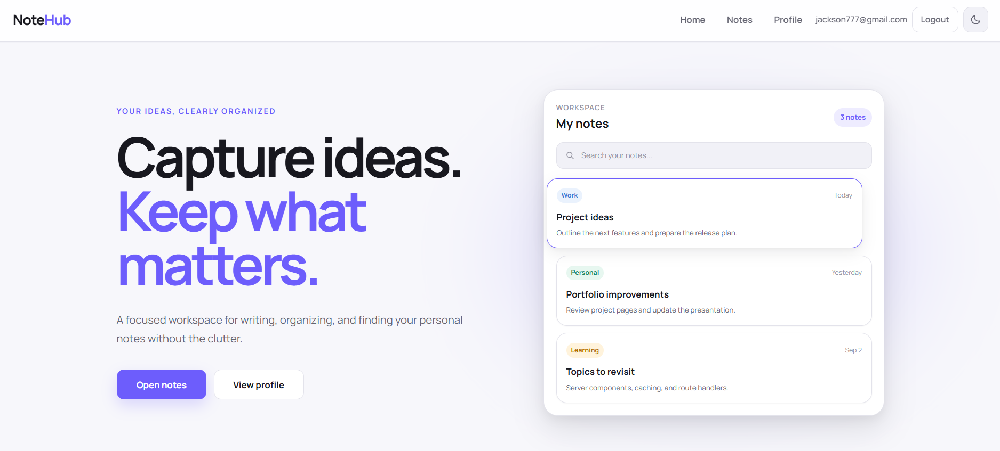
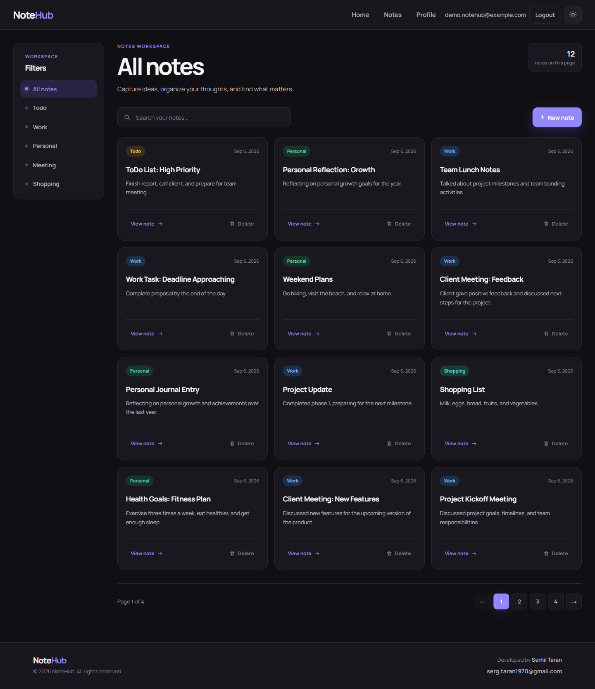
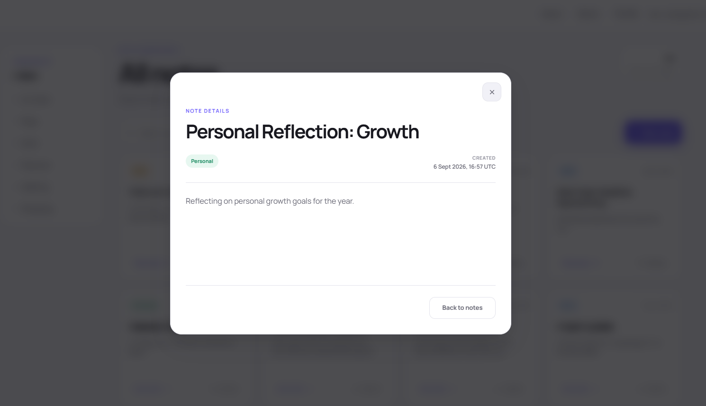
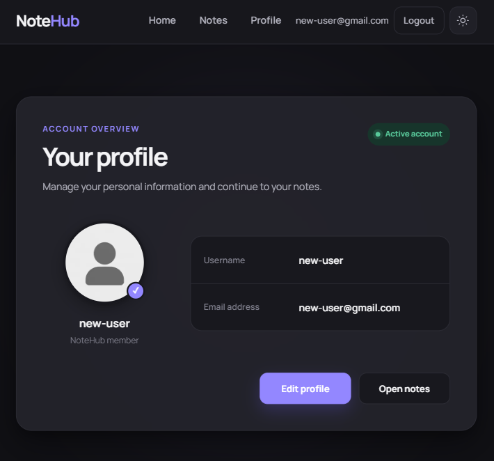
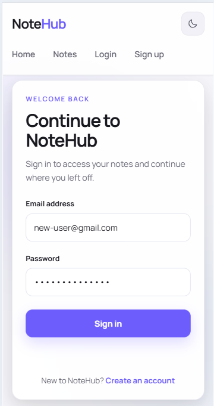
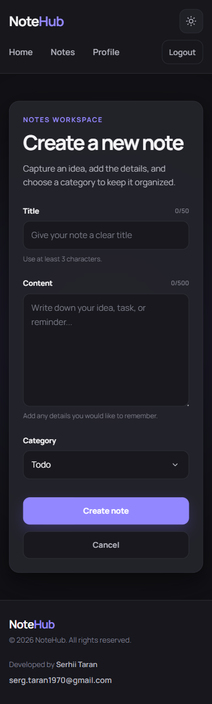

# NoteHub

A modern full-stack notes application for creating, organizing, searching, and managing personal notes.

NoteHub combines cookie-based authentication, protected routes, server-side data fetching, modal previews, responsive design, and light/dark themes in a polished productivity-focused interface.

## Live Demo

[Open NoteHub](https://notehub-app-plum.vercel.app/)

## Project Background

This project was originally created as an educational assignment during the GoIT Fullstack Developer course.

I independently rebuilt and expanded the original application into a portfolio-ready product by improving its architecture, implementing cookie-based authentication and protected routes, redesigning the complete user interface, adding light and dark themes, and refining responsiveness, accessibility, and user experience.

## Screenshots

### Home



### Notes Workspace



### Note Preview



### Tablet



### Mobile

| Sign In                                                                      | Create Note                                                                         |
| ---------------------------------------------------------------------------- | ----------------------------------------------------------------------------------- |
|  |  |

## Features

### Authentication

- User registration and sign-in
- Secure cookie-based sessions
- Automatic se'ssion restoration
- Protected application routes
- Logout with client state and cache cleanup
- Redirects based on authentication status

### Notes

- Create and delete personal notes
- Organize notes by category
- Filter notes by tag
- Search notes by keyword
- Paginated notes list
- Draft persistence while creating a note
- Dedicated note details pages
- Intercepting routes with modal note previews

### User Profile

- View profile information
- Edit username
- Display user avatar
- Synchronize profile updates with the global authentication state

### User Experience

- Responsive layout for mobile, tablet, and desktop
- Light and dark themes
- Persisted theme preference
- Theme initialization before hydration
- Loading, empty, error, and not-found states
- Toast notifications
- Keyboard-accessible modal dialogs
- Focus management and focus trapping
- Semantic design tokens

## Tech Stack

- [Next.js](https://nextjs.org/) 16
- [React](https://react.dev/) 19
- [TypeScript](https://www.typescriptlang.org/)
- [TanStack Query](https://tanstack.com/query/latest)
- [Zustand](https://zustand.docs.pmnd.rs/)
- [Axios](https://axios-http.com/)
- [React Hot Toast](https://react-hot-toast.com/)
- [React Paginate](https://www.npmjs.com/package/react-paginate)
- CSS Modules
- Next.js Route Handlers
- Vercel

## Application Architecture

The application uses the Next.js App Router and separates server-side and client-side API operations.

```text
app/
├── api/                         # Next.js Route Handlers
├── (auth routes)/               # Sign-in and sign-up pages
├── (private routes)/            # Protected routes
│   ├── @modal/                  # Intercepting note preview
│   ├── notes/                   # Notes workspace and details
│   └── profile/                 # Profile pages
├── error.tsx                    # Global error state
├── loading.tsx                  # Global loading state
├── not-found.tsx                # Global 404 page
└── page.tsx                     # Home page

components/
├── AuthNavigation/
├── AuthProvider/
├── Footer/
├── Header/
├── Modal/
├── NoteForm/
├── NoteList/
├── NoteView/
├── Pagination/
├── SearchBox/
├── SystemState/
├── TanStackProvider/
├── ThemeProvider/
└── ThemeToggle/

lib/
├── api/
│   ├── api.ts
│   ├── clientApi.ts
│   └── serverApi.ts
└── store/
    ├── authStore.ts
    ├── noteStore.ts
    └── themeStore.ts
```

## Routes

| Route                  | Description                | Access  |
| ---------------------- | -------------------------- | ------- |
| `/`                    | Home page                  | Public  |
| `/sign-in`             | User sign-in               | Public  |
| `/sign-up`             | User registration          | Public  |
| `/notes/filter/all`    | All notes                  | Private |
| `/notes/filter/[tag]`  | Notes filtered by category | Private |
| `/notes/action/create` | Create a new note          | Private |
| `/notes/[id]`          | Note details               | Private |
| `/profile`             | User profile               | Private |
| `/profile/edit`        | Edit user profile          | Private |

## Authentication

Authentication is handled through secure cookies. The browser communicates with internal Next.js Route Handlers, which forward authenticated requests to the NoteHub API.

Private routes include:

- `/notes/*`
- `/profile/*`

Authenticated users are redirected away from `/sign-in` and `/sign-up`. After registration, users are directed to their profile. After signing in, returning users are directed to their notes workspace.

## Getting Started

### Prerequisites

- Node.js 22
- npm

### Installation

Clone the repository:

```bash
git clone https://github.com/Serhii-Taran-dev/notehub-app.git
cd notehub-app
```

Install dependencies:

```bash
npm install
```

Create a local environment file:

```bash
cp .env.example .env.local
```

For local development, add the following value to `.env.local`:

```env
NEXT_PUBLIC_API_URL=http://localhost:3000
```

Start the development server:

```bash
npm run dev
```

Open [http://localhost:3000](http://localhost:3000) in your browser.

## Environment Variables

| Variable              | Description                                                                          |
| --------------------- | ------------------------------------------------------------------------------------ |
| `NEXT_PUBLIC_API_URL` | Base URL of the deployed or local NoteHub application used for internal API requests |

Production example:

```env
NEXT_PUBLIC_API_URL=https://notehub-app-plum.vercel.app
```

No client-side secret token is required. Authentication is handled through cookies.

## Available Scripts

```bash
npm run dev
```

Starts the development server.

```bash
npm run build
```

Creates an optimized production build.

```bash
npm run start
```

Starts the production server.

```bash
npm run lint
```

Runs ESLint.

```bash
npm run format
```

Formats the project with Prettier.

```bash
npm run format:check
```

Checks project formatting without modifying files.

TypeScript can be checked with:

```bash
npx tsc --noEmit
```

## Quality Checks

The project is verified with:

```bash
npm run format:check
npm run lint
npx tsc --noEmit
npm run build
```

The main user flows have also been tested manually:

- Registration, sign-in, and logout
- Session restoration
- Protected-route redirects
- Profile viewing and editing
- Notes creation, filtering, searching, pagination, and deletion
- Draft persistence
- Note previews and full note pages
- Light and dark themes
- Responsive layouts
- Loading, error, empty, and not-found states

## Backend

The application uses the NoteHub API provided by GoIT:

```text
https://notehub-api.goit.study
```

Requests from the browser are routed through the application's Next.js API layer to support cookie-based authentication.

## Author

**Serhii Taran**

- GitHub: [Serhii-Taran-dev](https://github.com/Serhii-Taran-dev)
- Email: [serg.taran1970@gmail.com](mailto:serg.taran1970@gmail.com)
